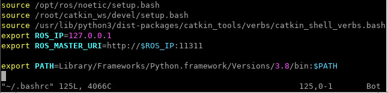

### Recommended Steps

#### On Host Computer (example command in Ubuntu)
1. `cd ~`
1. `mkdir ros`
1. `git clone https://github.com/Hafiidz/swarm.git ~/ros/catkin_ws/src/swarm`
1. `docker pull tiryoh/ros-desktop-vnc:noetic-amd64`
1. `docker run -p 6080:80 --shm-size=512m --name=rosn -it -v ~/ros/catkin_ws:/root/catkin_ws tiryoh/ros-desktop-vnc:noetic-amd64`
1. open a browser and got to localhost:6080 or http://127.0.0.1:6080/

#### Once inside docker container, create a new terminal
1. `sudo apt-get update`
1. `sudo apt-get -y install python3-pip`
1. `sudo apt install python-is-python3`
1. `pip install pandas`
1. edit bash file, for example, `vim ~/.bashrc` and add the following lines

    

1. `cd /root/catkin_ws`
1. `catkin_make`
1. `roscore`

#### create a second terminal
1. `rosrun turtlesim turtlesim_node`

#### create a third terminal
1. `rosrun swarm central.py`

