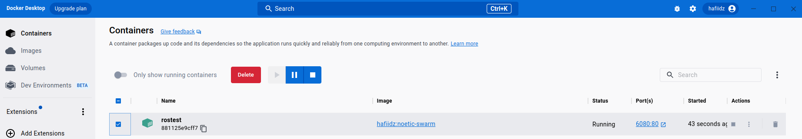
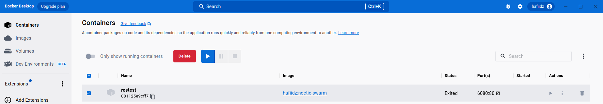

### Recommended Steps

# ROS drone show swarm project

## Project setup & resources
1. ros : this is the repo for Dockerfile and coordinate generation code https://github.com/Hafiidz/ros
1. swarm : this is the  repo for the swarm via turtlesim source code https://github.com/Hafiidz/swarm

## Steps (Initial Run)
1. Install Docker Desktop/Docker https://docs.docker.com/get-docker/
1. Run the following in the host terminal `docker run -p 6080:80 --shm-size=512m --name=rostest -it hafiidz/noetic-swarm:v0`
1. Open http://localhost:6080/ on your host PC browser
1. Inside the container, open a terminal and run: `roslaunch swarm central.launch`

## To stop the container
1. In the host terminal, get running container ID by running `docker ps` in the terminal
1. Next, run `docker stop [container_id]`

## Steps (Subsequence Run)
1. In the host terminal, run `docker start [container_id]`
1. Open http://localhost:6080/ on your host PC browser
1. Inside the container, open a terminal and run: `roslaunch swarm central.launch`

## Alternative Steps To Manage Containers via Docker Desktop
1. Alternatively using Docker Desktop GUI, once the initial run has been completed via the terminal, navigate to the Containers > select the running containers (rostest) and click pause or stop as necessary. The screenshot is as follows.

1. Similarly, one can start a containers that has been paused or stopped using the play (triangle button) as per following screenshot.

